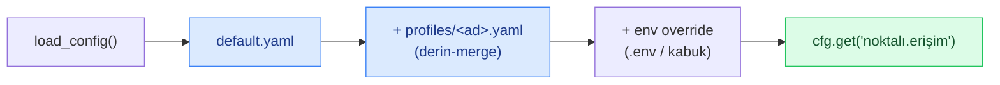

> 📂 **config/** · Merkezi Yapılandırma · [⬅ repo köküne dön](../README.md)

<div align="center">

# ⚙️ `config/` — Merkezi Yapılandırma


</div>

---

## 🧩 Ne yapar

`default.yaml` RoadGuard'ın **tek doğruluk kaynağıdır**. Hiçbir eşik/flag koda gömülmez;
tüm çalışma zamanı davranışı buradan yönetilir. `roadguard.config.load_config()` bu dosyayı
yükler, seçili env değişkenlerini override olarak uygular ve noktalı erişim sağlar:

```python
from roadguard.config import load_config
cfg = load_config()                       # sadece default.yaml
cfg = load_config(profile="server")       # default.yaml + profiles/server.yaml (derin-merge)
cfg.get("plate.voting_buffer_size")       # 7
cfg.get("stability.window")               # 16
```



---

## 🗂️ Profiller (`config/profiles/*.yaml`)

`default.yaml` üzerine **derin-merge** edilen overlay'ler; yalnız farkları içerir. Seçim
sırası: `--profile` argümanı > `ROADGUARD_PROFILE` env > yok. CLI: `--profile` bayrağı
(`roadguard`, `roadguard.eval`, `tools/test_video.py`, `tools/doctor.py`).

| Profil | Dedektör | Cihaz | imgsz | Hedef |
|---|---|---|---|---|
| `server` | yolo26l | auto (CUDA) | 960 | sunucu, maksimum doğruluk (önerilen) |
| `laptop` | yolo26s | auto (MPS) | 640 | geliştirme, hafif |
| `v4-finetune` | yolguvenligi_types_v4 (ESKİ yolov8m) | auto | 768 | A/B kıyas tabanı — production değil (production: YOLO26) |

Kendi profilinizi ekleyin (`config/profiles/uretim.yaml`) → `--profile uretim`. Liste:
`python -c "from roadguard.config import available_profiles as a; print(a())"`. Detay: `docs/dagitim.md`.

---

## 📁 Dosyalar

| Dosya | Açıklama |
|---|---|
| `default.yaml` | Aktif config (tüm parametreler) |
| `default.yaml.template` | Bootstrap fallback'i (`default.yaml` yoksa kopyalanır) |
| `calibration/ornek_kamera.yaml` | Tripwire/IPM hız kalibrasyon örneği |

---

## 📖 Parametre referansı

### `runtime`

| Anahtar | Değerler | Açıklama |
|---|---|---|
| `device` | `auto`/`cpu`/`cuda`/`mps` | Torch backend (auto = donanıma göre) |
| `source` | path / index / RTSP URL | Varsayılan girdi kaynağı |
| `log_level` | `DEBUG`/`INFO`/`WARNING` | Log seviyesi |
| `ai_mode` | `real`/`mock`/`auto` | `auto`: ultralytics+ağırlık varsa real, yoksa mock |

### `models.detector` / `models.driver_state`

`path` (ağırlık), `conf` (güven eşiği), `iou`, `imgsz`, sınıf listeleri. Custom fine-tune
ağırlığı için `path`'i değiştirin (bkz. `docs/egitim.md`).

### `stability`

`window: 16`, `min_consistent: 8` → 16/8 kuralı. Yeni durum ancak son 16 karenin ≥8'inde
tutarlıysa yazılır (flicker koruması).

### `plate`

`sweet_spot` (normalize ROI):

> [!IMPORTANT]
> **19 Haz fix:** canlı/telefon kamera için neredeyse tam-kadraj
> 0.03–0.97/0.06–0.98; kaliteyi frame-bölgesi değil piksel-boyut kapısı sınırlar.

`voting_buffer_size` (rejected-event kadansı), `consensus_ratio`, `ocr_lang`,
`regex` (Türk plaka), `min_pixel_height` (altında kalite tetiklenir),
`ocr_max_side` / `ocr_enhance_below_px` (OCR girdi boyut yönetimi),
`ocr_engine` (**`fastplate` varsayılan** | `easyocr` | `paddleocr`; seçilen motor kurulu
değilse her durumda loglu EasyOCR fallback). **`fastplate`** = plakaya-özel hafif ONNX
modeli (`global-plates-mobile-vit-v2`, ~5MB, `pip install fast-plate-ocr onnxruntime`;
`fastplate_model` ile model adı seçilir, ilk koşuda otomatik iner). Çıktı EasyOCR
`readtext` sözleşmesine sarılır → `_merge_line` + TR-normalizasyon + küçük-ROI ikinci-şans
motor-bağımsız çalışır.

> [!NOTE]
> **ÖLÇÜLDÜ (18 Haz 2026, 3 gerçek video, GT=34TC8532, CER=Lev/8):**
> easyocr baseline video_3'ü PENDING bırakıyordu (partial=`24IC8532`, CER 0.25 — uzak karelerde
> sistematik 3→2 il-kodu + T→I misread'i konsensüse girmiyordu); **fastplate video_3'ü
> CONFIRMED `34TC8532`'ye (CER 0.0) çekti VE video_1/video_2 exact'ini korudu (3/3 GT eşleşti).**

> [!CAUTION]
> **K-004:** config-driven motor seçimi, oran-bazlı, videoya-özel sabit/kara-liste YOK; fast-plate-ocr
> kurulu değilse easyocr baseline'ına şeffaf düşülür.

PaddleOCR için: `pip install 'roadguard[paddle]'`,
`ocr_gpu` (varsayılan `true` — OCR motorunu GPU'da çalıştır; **CUDA gerçekten kullanılabilir
değilse otomatik CPU'ya düşer**, `roadguard/device.cuda_is_usable` ile probe edilir. EasyOCR'a
`gpu=`, PaddleOCR'a sürüme göre `device=gpu`/`use_gpu=` olarak geçirilir),
`lp_detector.*` (sıkı plaka kırpma — **varsayılan eğitilmiş `custom_license_plate`**, YOLO26s,
held-out mAP50 0.983; A/B 3/3 korundu → varsayılan; yoksa loglu stok `lp_yolo11n`/geniş-crop fallback),
`lp_vote_min_px` / `lp_qod_below_px` (boyut-farkında kanıt: çok küçük LP oylamaya
girmez; küçük LP görüldüğü an `plate_too_small` QoD tetiği — consensus_fail beklemeden),
`voting.*` (kalıcı oy havuzu: `min_weight` = min kanıt, `margin_weight` = kazananla
ikinci arasındaki min **mutlak** fark (ASIL ayrım kriteri); `consensus_ratio` düşük
tutulur, 0.35 — dağınık misread'ler toplamı şişirip oranı düşürdüğünden margin esas
alınır; `fix1/fix2_weight`, `substring_weight`; `size_full_px`/`size_floor`/`no_lp_weight`
= okuma ağırlığı OCR güveni × kaynak kalitesi; `char_consensus` = pozisyon-hizalı karakter
füzyonu (`char_margin` = KANIT-İZİ `best_partial` füzyonunda pozisyon margini; **`confirm_min_char_margin`**
= ONAY-sıkı pozisyon eşiği, `>= char_margin`, `None`→`char_margin`: CONFIRMED için her pozisyonda
kazanan ikinciyi bu MUTLAK ağırlıkla geçmeli, değilse `pending` — gerçek ölçüm: yanlış ilk-harf
`0` margini ~1.55 / doğru `3` ~1.52 ikisi de `char_margin=1.5`'i geçip yanlış onaya gidiyordu, `2.0`
belirsizi PENDING yapar net plakayı onaylar); **`confirm_peak_weight`** (v2.3) = CONFIRM zemin koşulu: kazanan
plaka en az bir kez bu etkin-ağırlıkla (OCR güveni × kırpık kalitesi) okunmuş olmalı —
hep-uzak sistematik misread onaylanmaz; 0 = kapalı. Ek **pozisyon-veto** (v2.3): ayrı-aday
bütün-string marjını geçse bile her karakter pozisyonu belirsizse onay verilmez. — bkz.
`roadguard/plate/normalize.py`).

#### `early_read.*` — gri-bölge erken-okuma (v2.4)

`early_read.*` (v2.4 — **gri-bölge erken-okuma**, SOTA-bilgili, hepsi guard'lı, graceful;
**VARSAYILAN KAPALI** — aşağıdaki A/B gerekçesi): gerçek video_3 dersi — doğru `34TC8532` lp_h
67-83'te NET, uzak misread `14TC857` lp_h 24-28'de; `lp_vote_min_px=45` PLAIN (tek-motor, SR'siz)
okuma için **güvenlik ağı olarak KALIR**.

> [!WARNING]
> **A/B (19 Haz 2026, 3 gerçek video, MPS-YOLO+fastplate, GT=34TC8532):** `enabled=true` video_3'ü
> 2.10s → 1.26s erken onayladı AMA değer YANLIŞ (`34TC8512`, son hane 3→1). `ROADGUARD_ER_TRACE` ölçümü:
> lp_h 28-32'de fastplate `34TC8532`/`34TC8512`/`34TC8577` arası salınıyor, yanlış okumalar da conf
> 0.91-0.96 (conf ayırt etmiyor); ikinci motor (easyocr) bu boyutta plakayı hiç okuyamıyor → mutabakat
> ASLA oluşmuyor, yalnız `high_conf` kaçışı oya girip yanlışı onaya taşıyor. SR + 5-kare median füzyon
> aktifken bile salınım ayrışmadı (lp_h<45'te son-hane çözünürlük altında — FİZİKSEL LİMİT). correctness
> > latency (K-004) → erken-ama-yanlış config bırakılmaz; `enabled=false`. Scaffolding+guard'lar+testler
> KORUNUR; ikinci motorun GERÇEKTEN uyuştuğu sahnede güvenle açılabilir.

Gri-bölge `[gray_zone_min_px, lp_vote_min_px)` yalnız EK güvencelerle oya girer:
(a) **SR/güçlü upscale** (`super_resolution` opsiyoneli varsa o, yoksa Lanczos+unsharp `sr_scale`),
(b) **çok-kareli füzyon** (MF-LPR2 mantığı; hareketli araç için asıl kazanım: track başına son
`fuse_frames` kırpık ortak-yüksekliğe hizalanıp median'la birleşir → kare-arası gürültü düşer),
(c) **çok-motor mutabakatı** (`require_engine_agreement`: birincil + ikinci motor AYNI format-geçerli
plakayı okumalı; ikinci motor `agreement_engine` ile ya da birincilden FARKLI ilk kullanılabilir
motorla kurulur) **VEYA** `high_conf` üstü tek-motor okuma. Böylece `14TC857` tek-motor misread'i
oya **GİREMEZ**. Üretilen oy NORMAL havuza girer → position-veto + `min_weight` + confirm-zemin
onu da denetler (yanlış-onay imkânsız). `weight_cap` (<1): gri-bölge oyunun max kanıt ağırlığı
çarpanı — net/yakın okuma her zaman ezer. `enabled=false` ya da `lp_h < gray_zone_min_px` → EK yol
kapalı (PLAIN davranış). Yalnız gerçek-motor yolunda etkin (mock/sentetik akış etkilenmez).

> [!CAUTION]
> **K-004:** videoya-özel sabit/blacklist YOK; saf piksel-boyut + okuma-kalitesi kapısı. — bkz.
> `roadguard/plate/reader.py` (`_early_read`/`_er_upscale`/`_er_fuse`).

### `models.driver_state` (backend seçimi)

`backend: auto|pose|yolo` — pose: YOLO26-pose keypoint geometrisi (`pose_path` =
varsayılan `yolo26l-pose.pt`, yoksa s-pose'a loglu fallback; `pose_conf`,
`pose_kp_conf`, `phone_ear_ratio`, `smoke_mouth_ratio`, `roi_min_side`, `roi_enhance`) +
hibrit ROI nesne kanıtı (`roi_objects.*`); yolo: fine-tune YOLO26l detection.
`driver_crop.*`: modele giden alanı sürücünün kişi kutusuna (+`pad_ratio`) daraltır
(`redetect_every` = önbellek tazeleme, `min_gain` = ROI zaten darsa kırpmayı atla).
`fuse_detections` + `aux_classes`: Stage-1'in tam karede gördüğü phone/smoking
nesneleri araca düşüyorsa sürücü bayrağına OR'lanır.
`voting.*` (v2.3 — **Katman B `DriverStateEngine`**): per-`track_id` zaman-oylaması;
`window`/`min_votes` (16/8 = mevcut davranış) bir bayrağı kararlı saymak için pencere +
min True oy; `max_age` araç görünmeyince tamponun düşürüleceği kare. Eski per-(track,alan)
StabilityTracker çağrısının ID-merkezli karşılığıdır (aynı davranış + bellek temizliği).

### `speed`

`mode`: `metric` (oto-kalibrasyon) / `tripwire` / `ipm` / `disabled` (yalnızca
`relative_velocity_flag`). `calibration_file` ile kalibrasyon yüklenir.
`swerving.*`: dikkatsiz sürüş / yalpalama tespiti — `window_s` (saniye, fps-bağımsız),
`min_flips`, `amp_ratio` (o anki araç genişliği birimi, ölçek-bağımsız).

### `tracking`

`tracker`, `reid_model`, `min_track_frames` (ağır aşama + ÇIKTI kapısı: track bu kadar
kare yaşamadan OCR/pose çalışmaz VE annotation/event üretmez — tek/iki-kare hayalet
track koruması). `class_vote.*` (track başına **alan-ağırlıklı** araç-sınıfı oylaması:
`enabled`, `decay` = yardımcı unutma, `area_floor` = uzak araç oy tabanı — oy
`conf × bbox_alan/kare_alan` ile ağırlıklanır: yakın/büyük araç sınıfı daha güvenilir,
uzak araç onlarca kare `truck` görünse de yakındaki `car` kanıtı devralır).
Ek: `models.detector.dedup_iou` — aynı araca üretilen kopya kutuları bastırır.

### `qod`

`backend` (`mock`/`camara`), `endpoint`, `profiles` (optimize/quality), `histeresis`
(min_active_seconds + cooldown_seconds — tetikle-bırak salınımını önler),
`approach.*` (yaklaşma tetiği: `window`, `growth`, `min_area_ratio` — şartnamenin
"TOGG yaklaşınca QoD" senaryosu, `reason=vehicle_approach`).

### `risk`

ID-merkezli accumulator risk kuralları. `rules[].all_of` koşulları sağlanınca `RISK_ALERT`.

### `optional_modules`

§8 modülleri (`zero_waste_payload`, `super_resolution`, `homography_ipm`). **Default kapalı**;
kapalıyken import bile yapılmaz (lazy). Detay: `docs/mimari_ek_moduller.md`.

### `dashboard`

`serve` (statik serve), `default_bbox`, `theme` (`dark`/`light`).

---

## 🌱 Env override

`.env` (veya kabuk) bazı değerleri override eder: `ROADGUARD_PROFILE` (config profili),
`AI_MODE`, `ROADGUARD_DEVICE`, `ROADGUARD_INFERENCE_PORT`, `ROADGUARD_QOD_MOCK_PORT`, `ROADGUARD_NV_MOCK_PORT`.
