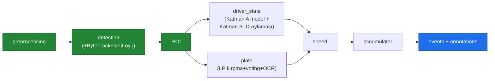

> 📂 **roadguard/** · YZ Çekirdeği · [⬅ repo kökü](../README.md)

<div align="center">

# 🧠 `roadguard/` — YZ Çekirdeği

RoadGuard'ın **gerçek** yapay zekâ / bilgisayarlı görü çekirdeği.


-orange?style=flat-square)


</div>

---

Upstream (kamera) ve downstream'i (dashboard/mobil) bilmez; yalnızca event + annotation stream yayar (decoupled mikroservis prensibi).

> [!NOTE]
> Çekirdek bilinçli olarak **decoupled** tasarlanmıştır: kamera ve dashboard/mobil katmanlarından habersizdir, sadece event + annotation stream üretir.

---

## 🔀 Pipeline akışı



<details><summary>📄 Orijinal ASCII akış diyagramı</summary>

```
preprocessing → detection(+ByteTrack+sınıf oyu) → ROI ──┬─ driver_state (Katman A model + Katman B ID-oylaması)
                                                        └─ plate (LP kırpma+voting+OCR)
                                          → speed → accumulator → events + annotations
```

</details>

Dedektör/cihaz/eşikler **config profilleriyle** seçilir (`--profile server|laptop|v4-finetune`).

---

## 🧩 Modüller

| Paket | Sorumluluk | Milestone |
|---|---|---|
| `preprocessing/` | Far/blur/yansıma/occlusion ön-işleme | M-sonrası |
| `detection/` | YOLO26 (l/s) + ByteTrack + sınıf oyu + ROI crop | M3 |
| `stability/` | 16/8 state machine + alan-ağırlıklı sınıf oyu (flicker koruması) | M4 |
| `driver_state/` | Katman A model (pose-hibrit/YOLO26l) + Katman B `DriverStateEngine` ID-oylaması (no-landmark) | M4 |
| `plate/` | Sweet spot + voting buffer + OCR + Türk plaka regex | M5 |
| `speed/` | tripwire / ipm / disabled (relative_velocity_flag) | M6 |
| `identity/` | `DriverLock` — sürücü kimlik kilidi (track ↔ sürücü ataması) | M4+ |
| `scene/` | `SignTracker` — sahne-seviyesi tabela takibi → aktif hız limiti | M6+ |
| `accumulator/` | ID-merkezli TrackRecord + risk kuralları | M3+ |
| `qod/` | CAMARA QoD istemcisi + histerezis | M5+ |
| `events/` | RoadGuardEvent / AnnotationFrame emitter | M7 |
| `pipeline/` | Orkestratör | M2+ |
| `optional/` | §8 modüller (lazy, default kapalı) | M12 |
| `eval/` | Metrikler + QoD A/B harness | M9 |

---

## 🛠️ Yardımcı modüller

| Modül | Açıklama |
|---|---|
| `config.py` | `load_config()` — `config/default.yaml` yükleyici (noktalı erişim) |
| `device.py` | Merkezi cihaz çözümleyici — `cuda`/`auto` istense de GPU gerçekten çalışabiliyor mu probe eder, yoksa sessizce CPU'ya düşer |
| `taxonomy.py` | Model-uzayı ↔ RoadGuard kanonik sınıf-adı eşlemesi (ör. `cell phone`→`phone`) — model değişince sözleşme değişmesin |
| `schema.py` | Pydantic v2 sözleşmeleri (TrackRecord, RoadGuardEvent, …) |
| `synthetic.py` | `python -m roadguard.synthetic` — sentetik örnek video + GT |
| `smoke.py` | `python -m roadguard.smoke` — adaptif kurulum/pipeline smoke testi |

---

## 🚀 Çalıştırma

```bash
python -m roadguard --source data/samples/ornek.mp4 --device auto
python -m roadguard --help
```

> [!TIP]
> `ai_mode: auto` (config) → ultralytics + ağırlık varsa gerçek YOLO; yoksa deterministik numpy mock dedektör (model olmadan tüm hat ve testler uçtan uca çalışır).
